

<!-- BANNER: terminal animada. Se genera con scripts/generate.py a partir de assets/profile.json. -->
<picture>
  <source media="(prefers-color-scheme: dark)"  srcset="assets/banner-dark.svg">
  <source media="(prefers-color-scheme: light)" srcset="assets/banner-light.svg">
  
</picture>

 

 

&nbsp;&nbsp;
<!-- Descomenta y pon tus datos:
&nbsp;&nbsp;
&nbsp;&nbsp;
-->

 

---

## `$ whoami`

<!-- Texto en assets/profile.json → "whoami". Se dibuja con fuente retro incrustada. -->
<picture>
  <source media="(prefers-color-scheme: dark)"  srcset="assets/whoami-dark.svg">
  <source media="(prefers-color-scheme: light)" srcset="assets/whoami-light.svg">
  
</picture>

---

## `$ ls ~/proyectos`

<table>
<tr>
<td>
<a href="https://github.com/alexisrja/carpa-de-saberes">
<picture>
  <source media="(prefers-color-scheme: dark)"  srcset="assets/project-carpa-de-saberes-dark.svg">
  <source media="(prefers-color-scheme: light)" srcset="assets/project-carpa-de-saberes-light.svg">
  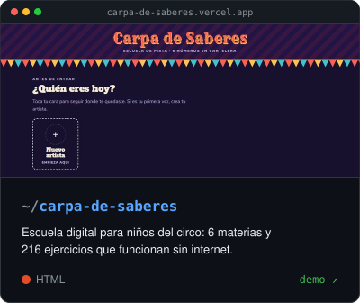
</picture>
</a>
</td>
<td>
<a href="https://github.com/alexisrja/EduClick">
<picture>
  <source media="(prefers-color-scheme: dark)"  srcset="assets/project-EduClick-dark.svg">
  <source media="(prefers-color-scheme: light)" srcset="assets/project-EduClick-light.svg">
  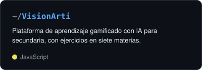
</picture>
</a>
</td>
</tr>
<tr>
<td>
<a href="https://github.com/alexisrja/RemitPay">
<picture>
  <source media="(prefers-color-scheme: dark)"  srcset="assets/project-RemitPay-dark.svg">
  <source media="(prefers-color-scheme: light)" srcset="assets/project-RemitPay-light.svg">
  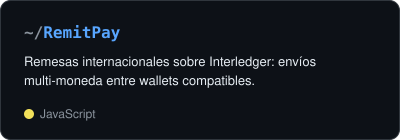
</picture>
</a>
</td>
<td>
<a href="https://github.com/alexisrja/wepsa">
<picture>
  <source media="(prefers-color-scheme: dark)"  srcset="assets/project-wepsa-dark.svg">
  <source media="(prefers-color-scheme: light)" srcset="assets/project-wepsa-light.svg">
  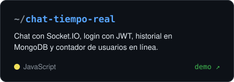
</picture>
</a>
</td>
</tr>
<tr>
<td>
<a href="https://github.com/alexisrja/plamari">
<picture>
  <source media="(prefers-color-scheme: dark)"  srcset="assets/project-plamari-dark.svg">
  <source media="(prefers-color-scheme: light)" srcset="assets/project-plamari-light.svg">
  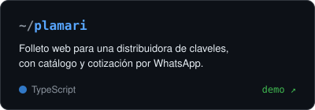
</picture>
</a>
</td>
<td>
<a href="https://github.com/alexisrja/gestor">
<picture>
  <source media="(prefers-color-scheme: dark)"  srcset="assets/project-gestor-dark.svg">
  <source media="(prefers-color-scheme: light)" srcset="assets/project-gestor-light.svg">
  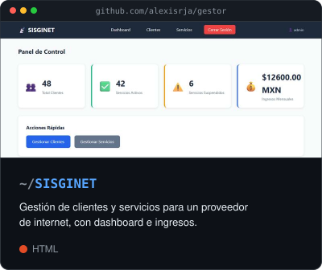
</picture>
</a>
</td>
</tr>
</table>

---

## `$ ssh alexis@umb`

Conectado a mi máquina. **Haz clic en un comando para ejecutarlo:**

<!-- Cada comando es un 
: es lo único que se puede "clicar" en un README de GitHub. -->

<code>$ neofetch</code>

 
<picture>
  <source media="(prefers-color-scheme: dark)"  srcset="assets/neofetch-dark.svg">
  <source media="(prefers-color-scheme: light)" srcset="assets/neofetch-light.svg">
  
</picture>

<code>$ man alexis</code>

 
<picture>
  <source media="(prefers-color-scheme: dark)"  srcset="assets/man-dark.svg">
  <source media="(prefers-color-scheme: light)" srcset="assets/man-light.svg">
  
</picture>

<code>$ history | tail -5</code>

 
<!-- Últimos commits públicos reales; el workflow los actualiza cada 12 h. -->
<picture>
  <source media="(prefers-color-scheme: dark)"  srcset="assets/history-dark.svg">
  <source media="(prefers-color-scheme: light)" srcset="assets/history-light.svg">
  
</picture>

<code>$ nsnake</code>

 
<!-- Generado por Platane/snk en el workflow: una serpiente se come la gráfica de contribuciones. -->
<picture>
  <source media="(prefers-color-scheme: dark)"  srcset="assets/snake-dark.svg">
  <source media="(prefers-color-scheme: light)" srcset="assets/snake-light.svg">
  
</picture>

<code>$ echo "tu mensaje" >> visitas.log</code> &nbsp;← firma el libro de visitas

 
<picture>
  <source media="(prefers-color-scheme: dark)"  srcset="assets/visitas-dark.svg">
  <source media="(prefers-color-scheme: light)" srcset="assets/visitas-light.svg">
  
</picture>
  

 
Abre un issue con tu mensaje en el título; aparece aquí en unos minutos y el issue se cierra solo.

<code>$ sudo rm -rf /</code>

 
<picture>
  <source media="(prefers-color-scheme: dark)"  srcset="assets/sudo-dark.svg">
  <source media="(prefers-color-scheme: light)" srcset="assets/sudo-light.svg">
  
</picture>

---

## `$ cat stack.txt`

---

## `$ mpv ~/musica/coding.m3u`

<a href="https://open.spotify.com/playlist/37i9dQZF1DX5trt9i14X7j">
<picture>
  <source media="(prefers-color-scheme: dark)"  srcset="assets/playlist-0-dark.svg">
  <source media="(prefers-color-scheme: light)" srcset="assets/playlist-0-light.svg">
  
</picture>
</a>
<a href="https://www.youtube.com/watch?v=NYzWdziId60&list=RDNYzWdziId60&start_radio=1">
<picture>
  <source media="(prefers-color-scheme: dark)"  srcset="assets/playlist-1-dark.svg">
  <source media="(prefers-color-scheme: light)" srcset="assets/playlist-1-light.svg">
  
</picture>
</a>

lo que suena mientras programo

---

## `$ ./señales`

<table>
<tr>
<td width="50%" align="center" valign="middle">

<!-- Autoevaluación: edita "skills" en assets/profile.json y el workflow la redibuja -->
<picture>
  <source media="(prefers-color-scheme: dark)"  srcset="assets/radar-dark.svg">
  <source media="(prefers-color-scheme: light)" srcset="assets/radar-light.svg">
  
</picture>

</td>
<td width="50%" align="center" valign="middle">

<picture>
  <source media="(prefers-color-scheme: dark)"  srcset="assets/card-langs-dark.svg">
  <source media="(prefers-color-scheme: light)" srcset="assets/card-langs-light.svg">
  
</picture>

<picture>
  <source media="(prefers-color-scheme: dark)"  srcset="assets/card-stats-dark.svg">
  <source media="(prefers-color-scheme: light)" srcset="assets/card-stats-light.svg">
  
</picture>

</td>
</tr>
</table>

<!-- Generado en este repo por scripts/generate.py (workflow cada 12 h). A propósito NO usa
     github-readme-stats / streak-stats: son instancias públicas que se caen seguido. -->
<picture>
  <source media="(prefers-color-scheme: dark)"  srcset="assets/heatmap-dark.svg">
  <source media="(prefers-color-scheme: light)" srcset="assets/heatmap-light.svg">
  
</picture>

---

<a href="https://alexisrja.github.io">
<picture>
  <source media="(prefers-color-scheme: dark)"  srcset="assets/continue-dark.svg">
  <source media="(prefers-color-scheme: light)" srcset="assets/continue-light.svg">
  
</picture>
</a>

<kbd>↑</kbd> <kbd>↑</kbd> <kbd>↓</kbd> <kbd>↓</kbd> <kbd>←</kbd> <kbd>→</kbd> <kbd>←</kbd> <kbd>→</kbd> <kbd>B</kbd> <kbd>A</kbd>

 
<picture>
  <source media="(prefers-color-scheme: dark)"  srcset="assets/konami-dark.svg">
  <source media="(prefers-color-scheme: light)" srcset="assets/konami-light.svg">
  
</picture>

 

`hecho con café y código · Estado de México`

